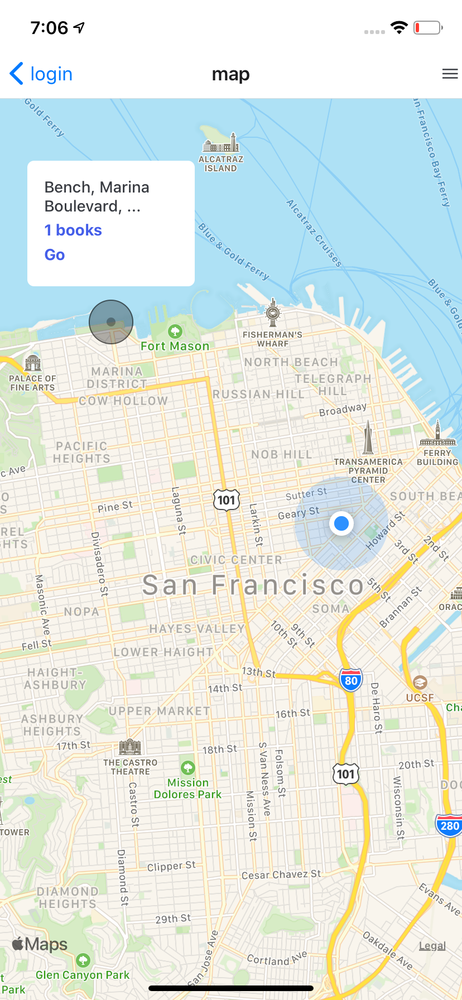
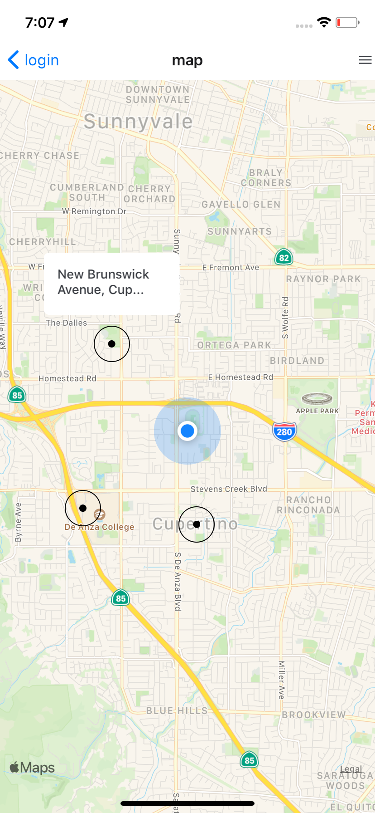
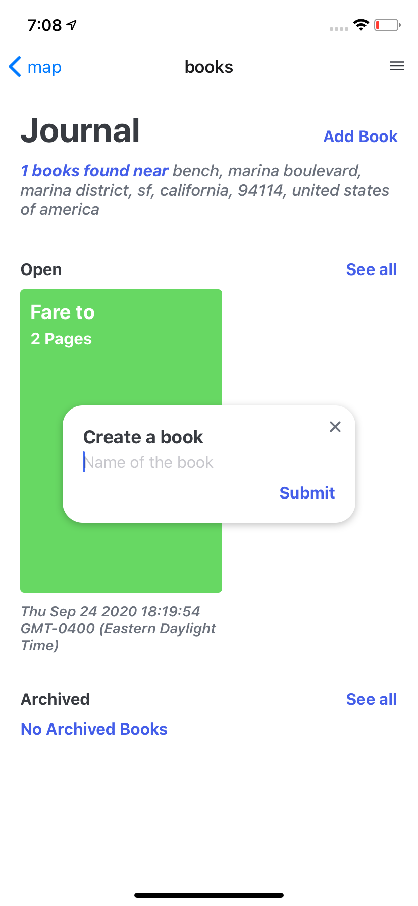
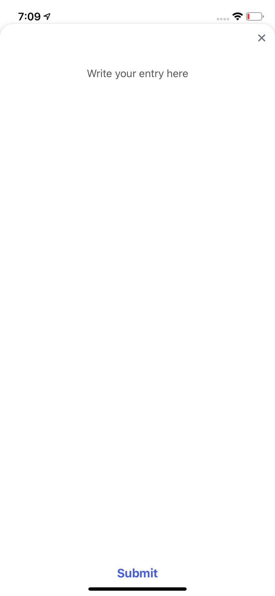
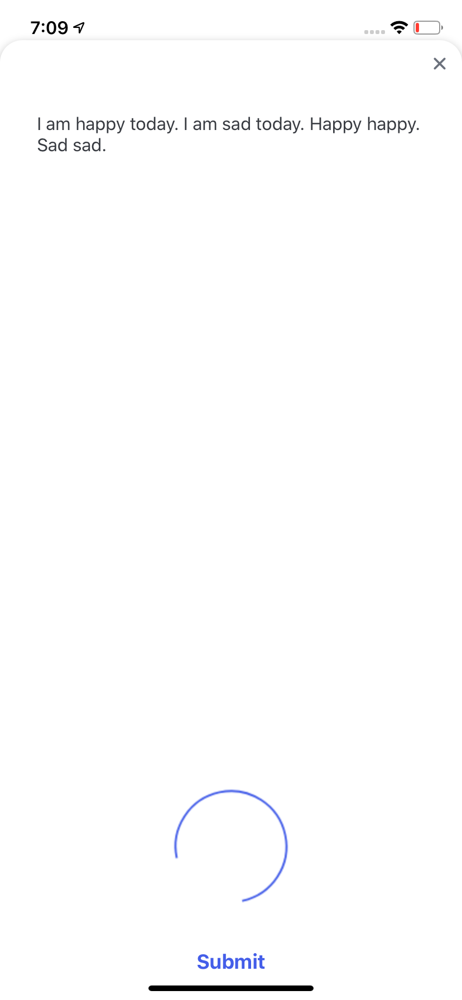
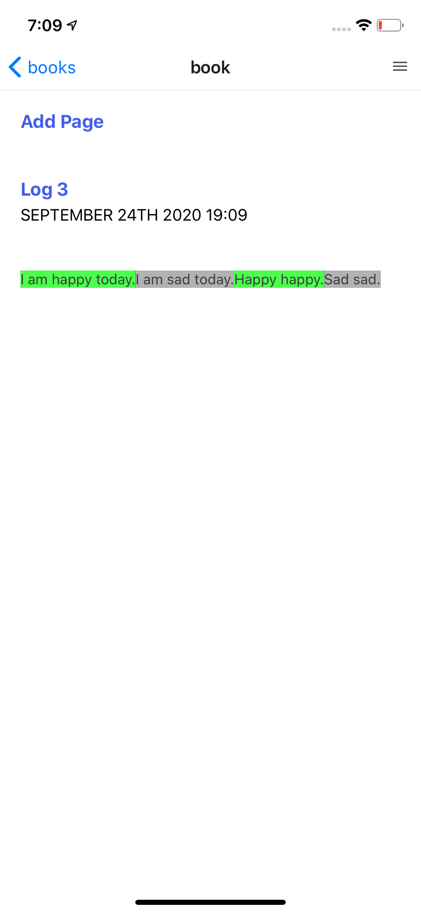
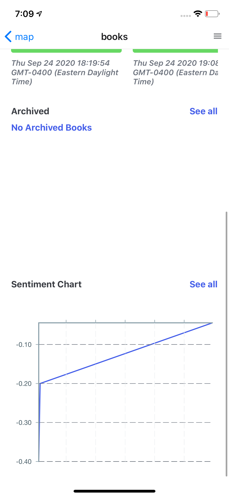

A Contemplation Book ios application that uses OpenStreetMap api to locate benches and place writable books. 
Books can be anonymously written in and on each page addition, sentiment and word frequencies are taken using a swift native module that cascades the score up from page to book to location so that sentiment and key topics of an area / bench can be tracked over time.

